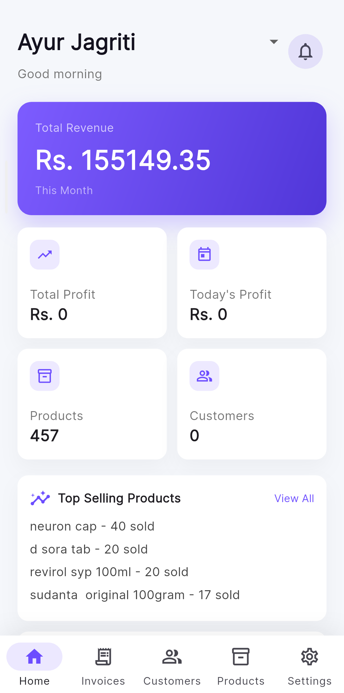
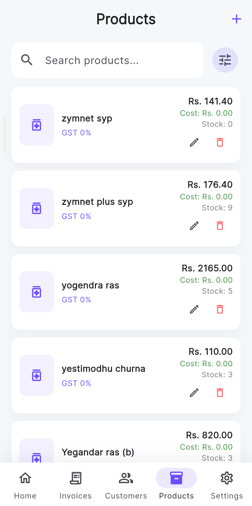
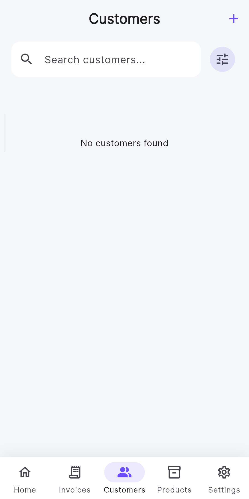
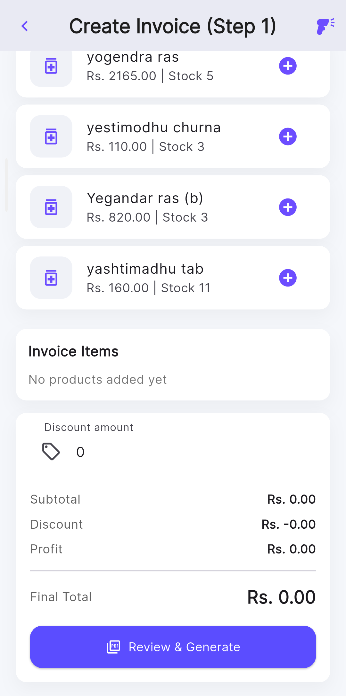
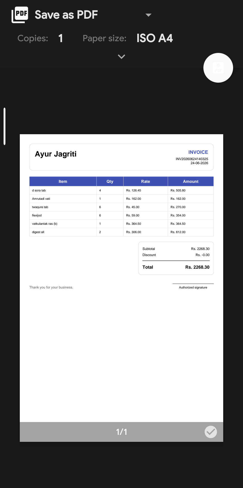

# Smart Bill

A Flutter-based billing and invoice management application designed for small businesses.

## Features

* Create invoices
* Product management
* Customer management
* Invoice history
* PDF invoice generation
* Offline storage using SQLite

## Tech Stack

* Flutter
* Dart
* SQLite
* PDF Package

## Screenshots

  
  
  

  
  

## Future Improvements

* Cloud sync
* GST support
* Inventory management
* Analytics dashboard

## Developer

Aditya

Role: Sole Developer
